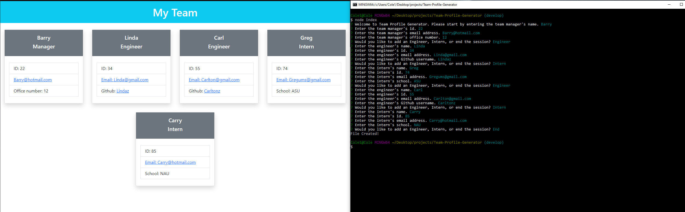

# Team Profile Generator

  

  ## Description 

  Generates cards for employees with information relative to their position in the company. This is all done from the command line.

  
  [https://colesammons.github.io/Team-Profile-Generator/](https://colesammons.github.io/Team-Profile-Generator/)
  

  ## Table of Contents

  * [Installation](#installation)
  * [Usage](#usage)
  * [Technologies](#technologies)
  * [Credits](#credits)
  * [License](#license)
  * [Contributing](#contributing)
  * [Tests](#tests)
  * [Questions](#questions)
   
  ## Installation
  
  Simply download or clone into a directory. Node is a prerequisite along with inquirer and jest. Once node is installed and initialized run 'npm install inquirer', then 'npm install --save-dev jest'.
  
  ## Usage

  Organizes employee information in a clean and orderly fashion.
  
  

  ## Technologies
  
  * Javascript
  * Node
  * Jest
  * Inquirer
  * Bootstrap

  ## Credits

  Cole Sammons

  
  ## License
  [MIT License](https://opensource.org/licenses/MIT)

  Copyright &copy; 2021
  

  ## Contributing

  No contributions at the moment

  ## Tests

  Run tests once jest is installed at the root of the directory with 'npm run test'.

  ## Questions

  Contact through email for any inquiries.

  colemsammons@gmail.com

  [https://github.com/ColeSammons/Team-Profile-Generator](https://github.com/ColeSammons/Team-Profile-Generator)
